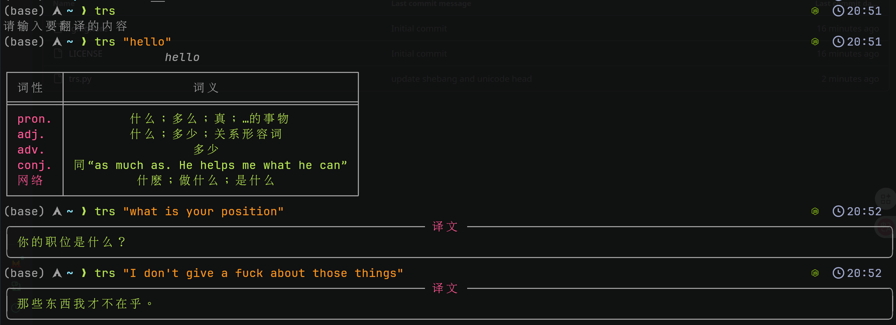
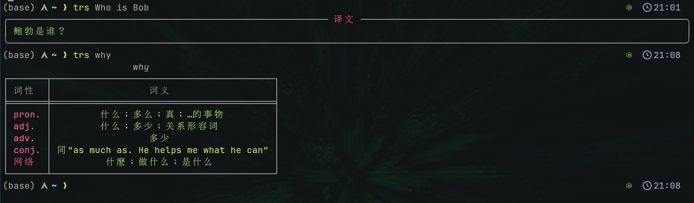

# trs

一个美观的Python翻译工具，支持单词释义和句子智能翻译。

注：本项目是一个十分简单的项目，任何python新手都可以自己写出来，放在这里只是为了方便借鉴和使用

## 项目简介

本项目是一个智能翻译工具，能够根据输入内容选择合适的翻译方式：

- 当输入为单个单词时，通过Bing网页获取该单词的多种词性及详细释义
- 当输入为句子或段落时，调用先进的大语言模型进行上下文感知的翻译
- 使用Rich库提供美观的命令行输出格式

## 功能特点

- **自动翻译模式切换**：自动区分单词和句子，采用不同的翻译策略
- **单词详细解析**：提供单词的词性和多种释义
- **高质量句子翻译**：利用大语言模型进行自然流畅的句子翻译
- **美观的输出界面**：使用Rich库实现色彩丰富的命令行显示效果
- **高度可配置**：代码十分简洁，关键参数可以自己调整
- **可快捷保存或复制**：可以快速将翻译内容复制到剪切板或指定目录

## 安装说明

### 前提条件

- Python 3.15
- 所需的Python包：`requests`, `rich`, `openai`, `bs4`

### 安装步骤

1. 克隆或下载本项目到本地
2. 安装依赖包：

```zsh
conda create -n trs-env  
conda activate trs-env
conda install openai rich bs4 requests
```

3. 设置API密钥（用于句子翻译功能）：

```zsh
export DASHSCOPE_API_KEY='您的API密钥'
```

## 使用方法

### 基本使用

直接在命令行中指定要翻译的内容：

```zsh
python trs.py "要翻译的单词或句子"

高级功能说明
```

```zsh
翻译工具 (trs)

使用方法:
  trs [-h] [-c] [-s] [text ...]

参数:
  text         要翻译的文本，可以是一个单词或一个句子，带引号或不带引号

选项:
  -h, --help   显示此帮助信息
  -c           启用某种功能
  -s           启用另一种功能

示例:
  trs what is your position
  trs "what is your position"
  trs what
  trs "what"
  trs -c
  trs -s
  trs -c hello world
  trs -s hello world
 
```

```zsh
python3 trs.py what
python3 trs.py what is this
python3 trs.py "what"
python3 trs.py "what is this"
```




都是可以的

## 配置说明

### 修改Python解释器路径

编辑脚本首行的shebang表达式，更改Python解释器的路径：
(conda preferred)

```python
#!/usr/bin/env python3
```

```python
#!/...conda_python_path/python3
```

### 翻译模型

默认使用阿里云qwen-mt-turbo模型，您可以修改代码更换其他模型

### API密钥配置

脚本会从环境变量`DASHSCOPE_API_KEY`中读取API密钥。也可以直接修改代码使用其他方式提供密钥

### 输出样式定制

Rich库的输出样式可以在脚本中的相关部分进行自定义：

## 注意事项

- 使用句子翻译功能需要有效的DASHSCOPE API密钥
- 脚本可能会因网页结构变化而需要调整解析逻辑

## 许可证

本项目采用MIT许可证，详见LICENSE文件。

---

*提示：使用本工具时请遵守相关服务（Bing、阿里云等）的使用条款和API调用限制。*
